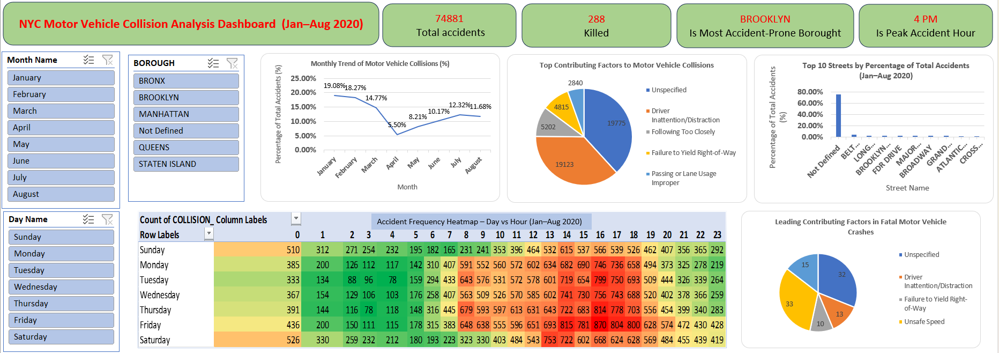

# NYC Motor Vehicle Collision Analysis Dashboard (Jan–Aug 2020)

## 📊 Project Overview
This project analyzes motor vehicle collision data reported by the New York City (NYC) from January to August 2020.

The dashboard explores accident patterns, contributing factors, severity distribution, and high-risk time periods.

---

## 🎯 Key Insights

- Driver Inattention/Distraction was the most common contributing factor.
- Unsafe Speed was the leading known cause of fatal crashes.
- April recorded the lowest accident percentage (COVID lockdown effect).
- Evening rush hours (4 PM–7 PM) showed the highest accident frequency.
- Brooklyn (depending on your result) reported the highest number of collisions.

---

## 📈 Dashboard Features

- KPI Cards (Total Accidents,Total Killed, Most Dangerous Hour, Most Accident-Prone Borough)
- Monthly Accident Trend (%)
- Day vs Hour Heatmap
- Top 10 Accident-Prone Streets
- Contributing Factor Distribution
- Interactive Slicers (Borough, Month, Severity)

---

## 🛠 Tools Used

- Microsoft Excel
- Power Query
- Power Pivot (DAX Measures)
- Pivot Tables
- Data Visualization Techniques

---

## 📂 Dataset Source

New York City Police Department (NYPD) Motor Vehicle Collision Data.

---

## 📸 Dashboard Preview

---

## 👤 Author

Raunak Gangwal
